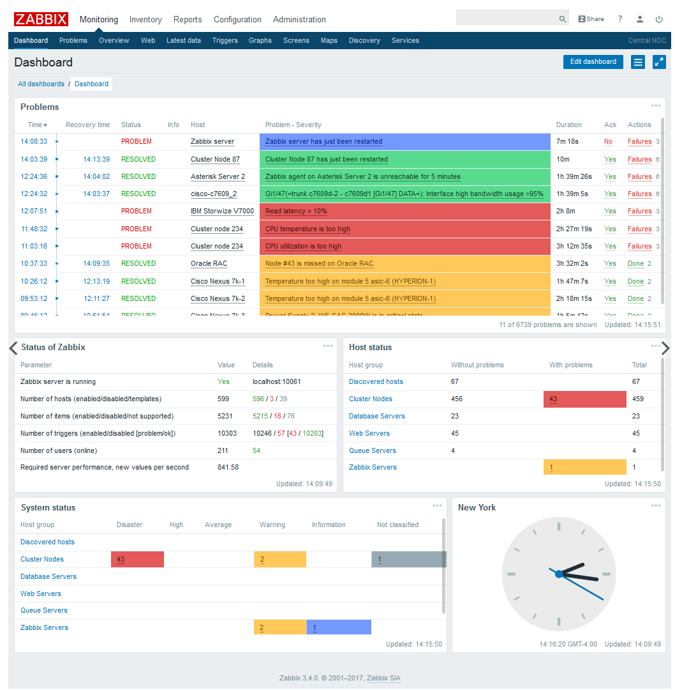
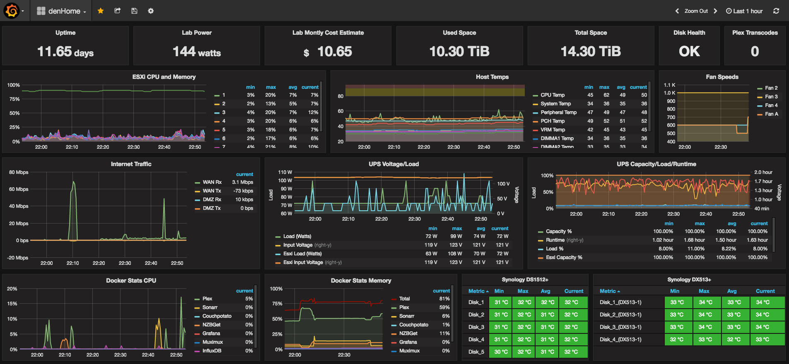

# Zabbix-Grafana Deep Dive Hands on lab 실습 교육

#### 목표
Open Source 모니터링 솔루션(Zabbix,Grafana)을 Microsoft Azure 환경에서 구축하고, 최신 버전의 Zabbix 설치부터 Zabbix의 다양한 기능을 통해, 네트워크, OS, H/W 등 다양한 인프라상의 지표를 수집, 알람을 설정하고 부족한 Zabbix의 Visualizing 기능을 보완할 Grafana를 연동하여 Dynamic한 DashBoard 화면을 구성하는 것이 목표입니다.

#### 학습자료
학습 관련 자료는 해당 Repository에 업데이트 예정입니다.

https://github.com/J-LiNDBERG/zabbix-grafana

## Zabbix Server 3.4 (latest)

InfluxDB, ElasticSearch 등 클라우드 환경에서는 시계열 DB가 유행하고 있지만, 정적인 IDC 환경에서 장점이 많은 Zabbix는 풍부한 Template과 간편한 알람 및 트리거 설정 등으로 인하여 많은 회사에서 사용되고 있습니다. 비슷한 제품군으로는 Nagios, Cacti 등이 있습니다.

- 일반적으로 Apache, PHP, MySQL, Zabbix-Server로 구성되어 있습니다.

> ####  Zabbix-Server 대시 보드 화면
> 

## Grafana

모니터링 관련하여 대부분의 Plugin을 지원하고 있으며, Zabbix 와 MySQL Plugin 또한 지원하고 있습니다. 동적인 Dashboard 구성과 미려한 디자인 덕분에 현업에서 많은 회사들이 사용 중입니다.

> ### Grafana 대시 보드 화면
> 
>  예시화면외에 사용자에 맞게 다양하게 구성이 가능합니다.

- Grafana를 구동하기 위한 설치 절차가 간편한 편입니다.
- 대시보드를 구성하는 방식은 설정에 따라 복잡할 수 도, 간단할 수 도 있습니다.

# 커리큘럼

## 1일차
* ### 개요 설명
  * 상용 모니터링 솔루션들과 Zabbix 비교
  * Zabbix 기능 소개
  * Grafana 기능 소개

* ### Azure 실습 환경 구성, 또는 Virtualbox에 구성
  * Azrue 1개월 평가판 계정 생성 (신용카드 정보 필요)
  * Monitoring 실습을 위한 환경 구축
    * Ubuntu Linux 1대, Windows Server 2012 R2 1대, MySQL 1대)
      * Ubuntu 접속 확인
      * Windows Server 2012 R2 접속 확인
      * MySQL 접속 확인
    * 모니터링 구성도 아키텍쳐 및 사용 포트 설명

* ### Zabbix 서비스 스택 구조 설명
  * Zabbix-Server
  * Zabbix-Agent
  * Zabbix-Proxy
  * Zabbix-Sender
  * Zabbix-JavaGateway

* ### Zabbix 설치 및 기동
  * Apache, PHP 설치 및 초기 설정
    * 한글 폰트 및 URL 설정
  * 설치된 MySQL DB에 Zabbix Schema 생성
  * Zabbix 3.4 버전 설치 방법 소개
    * Zabbix Server 설치 및 설정
  * Zabbix Server용 Agent 설치 및 설정
  * Zabbix Web 콘솔 기동 및 동작 확인
  * 기본 Web-Console 구성 설명

* ### 모니터링 대상 Windows Server Agent 설정
  * Windows Server용 Zabbix-Agent 설치 및 기동
  * Zabbix Server에 등록 및 Template 설정

## 2일차

* ### Zabbix Server Administration
  * General 설정
  * Proxies 설정
    * 다른 네트워크에 있는 Windows Server, Proxy를 통해 Data 수집해보기
  * Zabbix User 관리

* ### HostGroup과 Host
  * Item    
    * Zabbix-Trapper
    * External Script
    * Preprocessing 기능 설명
    * macros 기능 활용법
    * Check Item Value
  * Templates
    * Community Template 살펴보기
    * Linked Template 활용법
  * Maintenance 기능
  * Action
    * Auto Registration 사용해보기

## 3일차
* ### UserParameter & Low Level Discovery (LLD)
  * LLD 사용 이유 및 활용법
  * Zabbix-Agent UserParameter 사용해보기
    * LLD UserParameter 사용해보기
  * ProtoType 적용해보기

* ### Managing Alerts
  * Trigger 관련 Zabbix 주요 변수 설명
  * Media 설정 및 Alert 구현
    * Media 설정을 통한 E-Mail 및 Slack 이벤트 알람 받아보기

## 4일차
* ### Zabbix API 활용해보기
  * Python을 통한 Zabbix API 사용해보기
    * Host 정보 받아오기
    * 대량 Host 등록 해보기
  * API 활용 팁

* ### Zabbix Graph & Screen 구성 설명
  * Graph 설정
  * Screen 설정

* ### Grafana 대시보드 작성
  * Grafan 설치
  * Grafana 메뉴 구성 및 기본 설정
  * Zabbix & MySQL Plugin 설치 및 연동
  * DashBoard 꾸며보기

----

**교육 진행 상황에 따라 커리큘럼은 유동적으로 업데이트 될 수 있습니다.**
